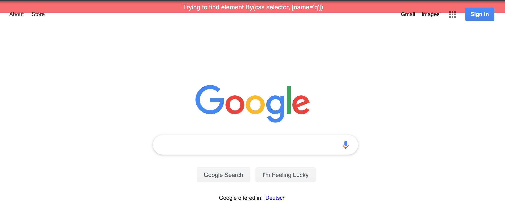

# webdriverjs-annotator
The package annotates elements with webdriverjs during test execution.
Use the package in you framework where you wrap the ``driver.findElements()`` function

no third party libraries are loaded to display the message as it should not interfere with 
the sites behaviour. The message is a simple div tag with inline styles

## Quickstart Guide

### install

```bash
npm install webdriverjs-annotator --save-dev
```

### use the package

```typescript
import {Annotator} from "webdriverjs-annotator"
```

```typescript
// Please dont use the promise manager of webdriverjs!
promise.USE_PROMISE_MANAGER = false;

const driver = await new Builder()
    .usingServer("http://127.0.0.1:4444/wd/hub")
    .forBrowser('chrome').build();

await driver.get("https://www.google.com");

// define the element locator for the element you want to interact with
// extract the locator to a page object
const locator = By.css(`[name='q']`);

// display the message (see screenshot)
await Annotator.displayTestMessage(driver, `Trying to find element ${locator.toString()}`);

const element = driver.findElement(locator);

// hide the message when the element is found
// if the element cant be found, the element is still displayed
// and you can create a screenshot of your browser
await Annotator.hideTestMessage(driver);

// after removing the message the element is highlighted 
// see screenshot
await Annotator.highlight(driver, element);
// the elements highlight is removed when the next element is highlighted


await element.sendKeys("selenium annotation elements");

await driver.quit();
```
#### message when trying to find an element



#### highlight an element when trying to interact with it


